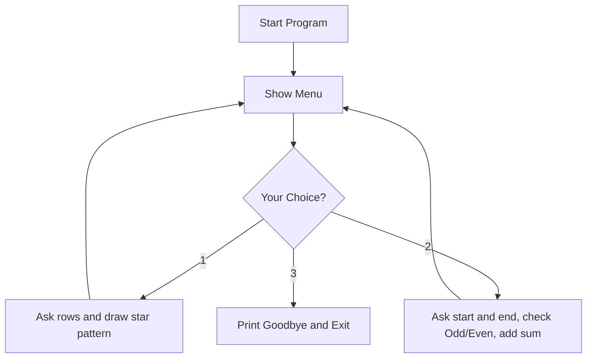

<div align="center">


</div>

---

## 🔴⚪ What is Logic Box?

**Logic Box** is a simple, menu-driven Python program that does two fun things:

1. 🔺 **Draws star patterns** (like a triangle) using loops
2. 🔢 **Analyzes numbers** in a range — tells you which are odd/even and adds them all up

It's a beginner-friendly project that shows off how loops, `range()`, and `match-case` work in real life — no boring theory, just a clean little tool you can run and play with.

---

## 🎥 Video Explanation

> 📌 *A short walkthrough video is included to explain how the code works, step by step.*

In the video, I cover:

- 🧠 How the menu keeps showing up using a `while True` loop
- ⭐ How the **nested loop** builds the triangle pattern row by row
- 🔁 How the **for loop** checks each number as odd or even and adds it to the total
- 🚪 How choosing option `3` breaks the loop and exits the program cleanly
- 🐍 A live demo — running the program and trying all 3 options

▶️ **[Watch the video here](#)** *(replace this link with your uploaded video/YouTube link)*

---

## ✨ Features

| Feature | Description |
|---|---|
| 🔺 Pattern Generator | Type a number, get a right-angled triangle made of stars |
| 🔢 Number Analyzer | Enter a start & end number, see odd/even + total sum |
| 🎛️ Simple Menu | Everything runs from one easy-to-use menu |
| 🔄 Loops Forever | Menu keeps coming back until you choose Exit |
| 🚀 Zero Setup | No libraries needed — pure Python, runs instantly |

---

## 🖥️ How It Looks When You Run It

```

Welcome to the Pattern and Number Analyzer!

Select an Option :
1. Generate a Pattern
2. Analyze a Range of Numbers
3. Exit
Enter Your Choice: 1
Enter the number of rows for the pattern: 5
*
* *
* * *
* * * *
* * * * *

```

```

Select an Option :
1. Generate a Pattern
2. Analyze a Range of Numbers
3. Exit
Enter Your Choice: 2
Enter the start of range: 10
Enter the end of range: 15
Number 10 is Even
Number 11 is Odd
Number 12 is Even
Number 13 is Odd
Number 14 is Even
Number 15 is Odd
Sum of all numbers from 10 to 15 is: 75

```

---

## 🚀 How to Run It

1. Make sure Python is installed on your computer (Python 3.10 or newer, since this project uses `match-case`)
2. Download or clone this repository
3. Open a terminal in the project folder
4. Run this command:

```bash
python logic_box.py
```

5. Follow the on-screen menu and enjoy! 🎉

---

## 🧩 How It Works (In Simple Words)



- The program keeps looping and showing the menu again and again
- Whatever you type gets checked with `match-case`
- Once you pick **Exit**, the loop breaks and the program stops

---

## 🛠️ Tech Used

- 🐍 **Python** — the only language used
- 🔁 **for / while loops** — the heart of this project
- 🎯 **match-case** — clean way to handle menu choices

---

## 📂 Project Structure

```
Logic Box/
│
├── logic_box.py     # Main program file
└── README.md        # You're reading it!
```

---

## 🙋‍♂️ Author

**Pal Anghan**
🎓 BCA Student | 💻 MERN Stack Developer | 🐍 Python Enthusiast

---

<div align="center">

### ⭐ If you liked this project, give it a star!


</div>
